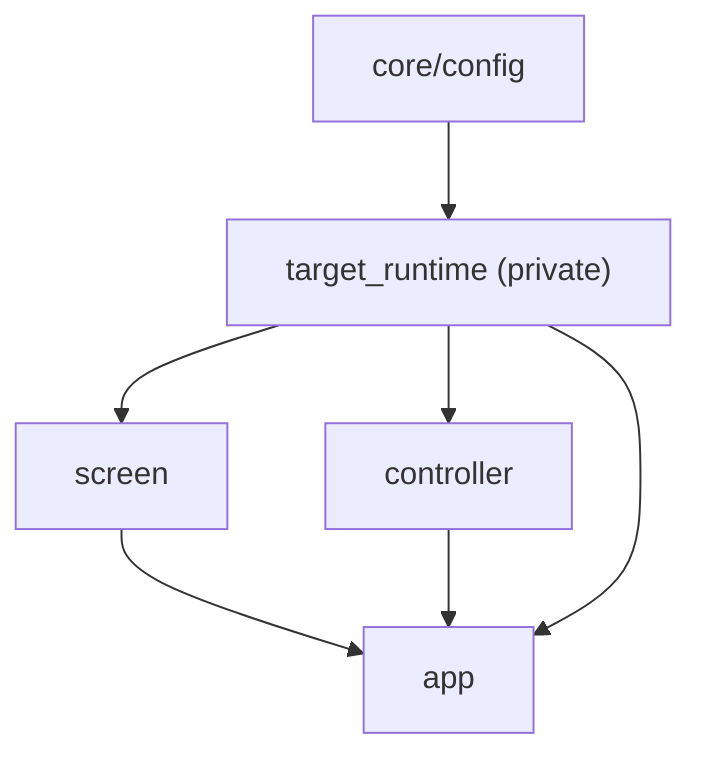

# aura_base 运行时与平台适配层

`plans/aura_base/` 既是共享动作能力包，也是当前仓库里最关键的设备运行时层。它现在对外暴露统一的 runtime facade，同时保留 MuMu 作为最成熟的实现，并新增了最小 `WindowsDesktopAdapter` 骨架。

## 当前能力边界

从代码结构看，`aura_base` 当前稳定暴露四层能力：

1. `target_runtime`
   私有运行时服务，负责根据配置解析 provider、创建并维护底层 adapter。
2. `screen`
   面向截图与像素读取的公共服务。
3. `controller`
   面向指针、键盘、文本输入的公共服务。
4. `app`
   对 `screen + controller + target_runtime` 的高层组合封装。

服务依赖关系如下：



## 平台抽象

平台层位于 `plans/aura_base/src/platform/`，当前已经明确区分了三类契约：

- `RuntimeAdapter`
  统一描述捕获、焦点、输入、自检等运行时能力。
- `CaptureBackend`
  统一描述截图与像素读取能力。
- `InputBackend`
  统一描述点击、移动、拖拽、按键与文本输入能力。

现有实现包括：

- `mumu/*`
  当前最成熟的 Android 模拟器实现。
- `windows/desktop_adapter.py`
  最小可用的 Windows 桌面 provider 骨架。

## 当前配置

推荐的新配置结构：

```yaml
runtime:
  family: android_emulator
  provider: mumu
  startup_timeout_sec: 10
  providers:
    mumu:
      adb:
        executable: adb
        serial: auto
        timeout_sec: 15
        connect_on_start: false
      capture:
        max_stale_ms: 1000
      input:
        remote_dir: /data/local/tmp/aura
        helper_path: android_touch
        path_fps: 10
      key_input:
        provider: adb
      text_input:
        provider: adb
```

兼容层仍然保留旧写法：

- `target.provider`
- `target.mumu`

如果检测到旧配置，运行时会给出 warning，但不会直接中断。

## Provider 状态

### MuMu

MuMu 仍然是当前最完整、测试覆盖最充分的 provider：

- 支持 ADB 设备发现和自动挑选健康 serial
- 支持 `scrcpy_stream` 截图
- 支持 Android touch helper 输入链路
- 支持 runtime 自检

`tests/test_aura_base_mumu_runtime.py` 仍然是这条路径的行为基线。

### Windows Desktop

`WindowsDesktopAdapter` 当前是最小骨架，目标是让公共服务层不再写死 MuMu-only 语义：

- 提供桌面截图
- 提供基础鼠标与键盘事件
- 提供自检与桌面尺寸信息

这条路径当前更适合作为平台抽象落点，而不是完整的游戏自动化实现。

## `screen`、`controller`、`app` 三层封装

### `screen`

职责：

- 返回可用 capture backend 列表
- 设置默认截图 backend
- 截图
- 读取像素
- 聚焦窗口或桌面
- 暴露 `self_check()`

要点：

- `capture()` 失败时不会直接抛出，而是转成 `CaptureResult(success=False, quality_flags=[...])`
- `focus()` 失败时会记录 warning 并返回 `False`

### `controller`

职责：

- 点击、移动、拖拽、滚动
- 按键按下/抬起/连按
- 文本输入
- 管理已按下的键和鼠标按钮，支持 `release_all()`

### `app`

职责：

- 把 `screen` 和 `controller` 组合成更高层的交互 facade
- 提供同步和异步版本的截图、点击、拖拽、滚动、输入
- 提供 `focus_with_input()`

## 当前真实结论

- `aura_base` 已经开始具备“平台适配层 + 公共交互层”的骨架。
- MuMu 仍然是默认、最稳定的 provider。
- Windows 桌面 provider 已有最小骨架，但不应被宣传为与 MuMu 同等成熟。
